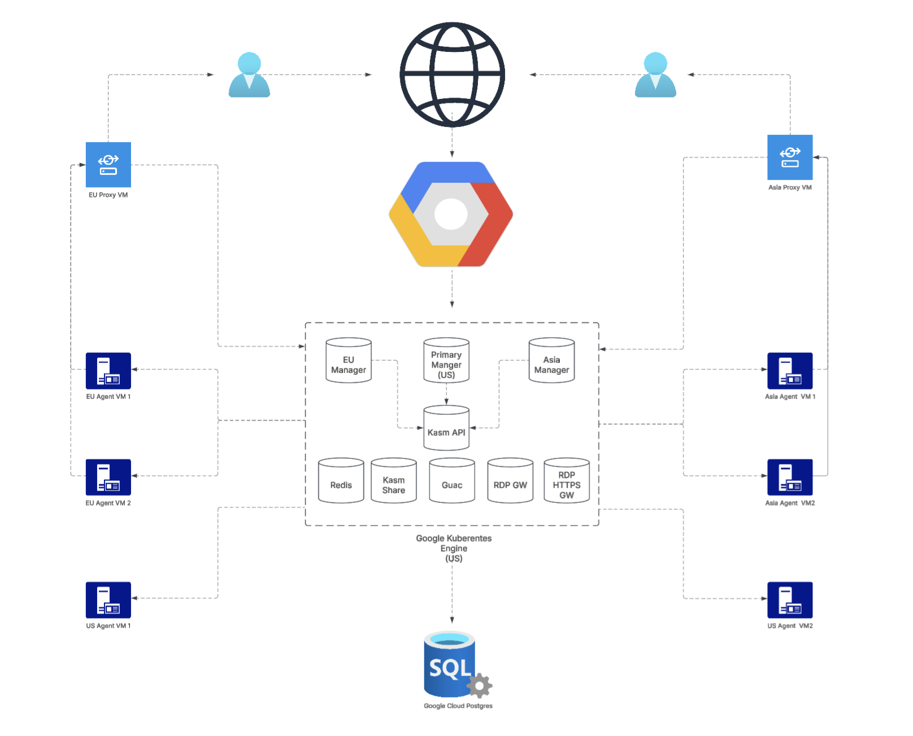

# Kasm GCP Deployment (Python)
This example automates the deployment of a **multi-zone Kasm** across Google Cloud Platform (GCP). The script sets up all necessary resources, including networking, PostgreSQL database, Kubernetes cluster, and Kasm agents and proxies for seamless deployment.



## Prerequisites

Before using the Pulumi script, ensure that the following requirements are met:

- **Pulumi**: Install [Pulumi](https://www.pulumi.com/docs/get-started/) to manage your infrastructure as code.
- **Python**: Make sure [Python](https://www.python.org/downloads/) 3.12 or higher is installed on your machine, along with [pip](https://packaging.python.org/en/latest/guides/installing-using-linux-tools/) and [virtualenv](https://virtualenv.pypa.io/en/latest/installation.html).  If you're having trouble setting up Python on your machine, see [Python 3 Installation & Setup Guide](https://realpython.com/installing-python/) for detailed installation instructions on various operating systems and distributions.
- **GCP Account**: You’ll need a Google Cloud Platform (GCP) account with appropriate permissions to create and manage resources.
  - A list of required IAM permissions can be found [here](docs/GCP_PERMISSIONS.md).
  - A list of required GCP APIs can be found [here](docs/GCP_APIS.md).
- **Google Cloud SDK**: Install the [Google Cloud SDK](https://cloud.google.com/sdk/docs/install) to authenticate and configure your GCP environment. 
- **Google Cloud SDK GKE component**: Make sure the [Google Cloud SDK GKE component](https://cloud.google.com/kubernetes-engine/docs/how-to/cluster-access-for-kubectl#install_plugin) is installed, so Pulumi can interact with the created GKE cluster.
  
Additionally, you will need the following information ready before proceeding further:
- **Kasm Hosting Domain**: The domain where Kasm will be hosted, e.g., `kasm.kasm-test.com`.
- **GCP Project**: The GCP project where you want to deploy the Pulumi resources.
- **GCP Region**: The GCP region where Kasm will be hosted.
- **Additional Zones**: Decide if you'd like additional zones and specify their corresponding GCP region(s).
- **Agent**: Define the agent VM size and the number of agents for each Kasm zone.
- **Additional Zone DNS Name**: DNS name for the additional Kasm zone, e.g., `europe.kasm.kasm-test.com`.
- **Additional Zone Proxy DNS Name**: DNS name for the Kasm proxy in the additional zone, e.g., `proxy-europe.kasm.kasm-test.com`.
- **SSL Certificate**: Ensure you have an SSL certificate covering the following domains:
    - Kasm domain (e.g., `kasm.kasm-test.com`)
    - Additional zone DNS name (e.g., `europe.kasm.kasm-test.com` and `asia.kasm.kasm-test.com`)
    - Additional zone proxy DNS name (e.g., `proxy-europe.kasm.kasm-test.com` and `proxy-asia.kasm.kasm-test.com`)
- **Cloud DNS Creation**:
    - **If Yes**: If you want the Pulumi script to create Cloud DNS, you will need to point your domain to the created Cloud DNS after the script completes and provide your domain’s DNS name in the Pulumi configuration.
    - **If No**: If you prefer not to have the Pulumi script create Cloud DNS, you must provide the name of your existing GCP Cloud DNS zone.

## Authenticate with GCP
You can authenticate with GCP using either a user account or a service account.

**Note:** Make sure your GCP user or service account has all the required [GCP Permissions](docs/GCP_PERMISSIONS.md).


### Authenticate with a GCP User Account
To authenticate using a standard GCP user, run the following commands:

```bash
gcloud auth login
gcloud auth application-default login
gcloud config set project {GCP_PROJECT_ID}
```
Replace {GCP_PROJECT_ID} with your actual GCP project ID.

### Authenticate with a Service Account
If you're using a service account, run the following command:

```bash
gcloud auth activate-service-account --key-file=/PATH/TO/gcloud-service.key --project={GCP_PROJECT_ID}
gcloud config set project {GCP_PROJECT_ID}
```
Replace {GCP_PROJECT_ID} with your actual GCP project ID.

For instructions on how to create a service account key, refer to the [GCP Service Account Documentation](https://cloud.google.com/iam/docs/keys-create-delete).

## Clone Git repo
```bash
git clone https://github.com/kasmtech/Kasm-Pulumi
cd Kasm-Pulumi/gcp
```

## Setup Python Environment
```bash
python3 -m venv venv
source venv/bin/activate
pip install -r requirements.txt
```

> Make sure [Python](https://www.python.org/downloads/) 3.6 or higher is installed on your machine, along with [pip](https://packaging.python.org/en/latest/guides/installing-using-linux-tools/) and [virtualenv](https://virtualenv.pypa.io/en/latest/installation.html).  If you're having trouble setting up Python on your machine, see [Python 3 Installation & Setup Guide](https://realpython.com/installing-python/) for detailed installation instructions on various operating systems and distributions.

## Login Pulumi
If you already have a Pulumi account, simply run the following command:
```bash
pulumi login
```

If you'd prefer to use Pulumi locally (without login), run:

```bash
pulumi login --local
```

## Setup Pulumi Stack
```bash
pulumi stack init dev
cat Pulumi.dev.yaml.example >> Pulumi.dev.yaml
export PULUMI_CONFIG_PASSPHRASE="{PASSPHRASE}"
pulumi config set gcp:project {GCP_PROJECT_ID} --stack dev
```
Replace `{PASSPHRASE}` with your actual Pulumi passphrase and `{GCP Project ID}` with your actual GCP project ID.
**Note**: If you'd like to permanently save the `PULUMI_CONFIG_PASSPHRASE` environment variable, run the following command:
```bash
echo 'export PULUMI_CONFIG_PASSPHRASE="{PASSPHRASE}"' >> ~/.bashrc
```

If you are using a GCP service account, make sure to execute the following command to configure your credentials:
```bash
pulumi config set gcp:credentials /PATH/TO/gcloud-service.key --stack dev
```

## Config Pulumi Stack
Configure the `Pulumi.dev.yaml` file by modifying it as follows:

### kasm-gcp:data
- **region**: The GCP region for the primary Kasm zone. Example: `us-west2`.
- **zone**: The GCP zone for the primary Kasm zone. Example: `us-west2-a`.
- **auto_enable_gcp_api**: Set to `true` to allow Pulumi to automatically enable all necessary GCP APIs in the specified GCP project, this requires one of the following permissions in the GCP project: `roles/owner`, `roles/editor` or `roles/serviceusage.serviceUsageAdmin`. A list of the required APIs and instructions on how to enable them can be found [here](docs/GCP_APIS.md)
- **agent_enable_ssh**: Set to `true` to enable SSH access for Kasm agent and proxy VMs, otherwise set to `false`.
- **domain**: The domain to be used for the primary Kasm zone (e.g., `kasm.kasm-test.com`). The domain needs to be owned by you.
- **agent_size**: The instance size for Kasm agents in the primary zone. Example: `e2-standard-4`.
- **agent_number**: The number of Kasm agent instances to deploy in the primary zone. Example: `2`.
- **agent_disk_size**: The disk size (in GB) for each Kasm agent instance across **all** zones. Example: `100`.
- **db_tier**: The tier for the GCP PostgreSQL database is specified as `db-custom-{core_count}-{RAM_in_MB}`. We recommend using at least 2 cores and 3840 MB of RAM for optimal performance. For example, `db-custom-2-3840` represents a database tier with 2 CPU cores and 3840 MB of RAM.
- **cert**: Leave it as it is for Helm to generate a self-sign certificate. To use your own cert, run the command to set the value: `cat /path/to/cert.pem | pulumi config set --path data.cert --secret --stack dev `
- **cert_key**: Leave it as it is for Helm to generate a self-sign certificate. To use your own cert, run the command to set the value: `cat /path/to/cert.key | pulumi config set --path data.cert_key --secret --stack dev`

**Note**: We highly recommend using the following DNS structure for a multi-zone Kasm setup:
- Assume Kasm domain is `kasm.kasm-test.com`.
- Additional zone DNS names should be subdomains of the Kasm domain (e.g., `europe.kasm.kasm-test.com`).
- Additional zone proxy DNS names should also be subdomains of the Kasm domain (e.g., `proxy-europe.kasm.kasm-test.com`), at the same level as the additional zone DNS names.

The multi-zone setup must have a valid SSL certificate, and the provided certificate must cover all of the following:
- Kasm domain (e.g., `kasm.kasm-test.com`)
- Additional zone DNS names (e.g., `europe.kasm.kasm-test.com`, `asia.kasm.kasm-test.com`)
- Additional zone proxy DNS names (e.g., `proxy-europe.kasm.kasm-test.com`, `proxy-asia.kasm.kasm-test.com`)

### kasm-gcp:data.cloud_dns_zone
- **create**: Set to `true` if you do not have a Cloud DNS zone already, the Pulumi script will create a new Cloud zone for you and you need to manually link your domain to this DNS zone. Set to `false` if you already have a cloud dns zone (thats already connected to your domain), the cloud dns will not be created, instead we will use the existing one.
- **zone_name**: The name of the GCP Cloud DNS zone to be used (e.g., `kasm-test-com`). the config is only used when `create=false`
- **zone_dns_name**: The GCP DNS name for the Cloud DNS zone (e.g., `kasm-test.com.`). the config is only used when `create=true`

### kasm-gcp:data.additional_kasm_zone
A list of additional Kasm zones to deploy. If you don’t wish to deploy any additional Kasm zones, simply remove this section from the Pulumi configuration file. Each zone will have its own set of configurations:

- **name**: A unique identifier for each additional Kasm zone (e.g., `europe`, `asia`).
- **region**: The GCP region where the additional Kasm zone will be deployed (e.g., `europe-west2`). Each additional zone should reside in its own unique region.
- **zone**: The GCP availability zone within the specified region for the additional Kasm zone (e.g., `europe-west2-a`).
- **proxy_size**: The instance size for the Kasm proxy server in the additional zone. Example: `e2-standard-2`.
- **agent_size**: The instance size for the Kasm agent servers in the additional zone. Example: `e2-standard-4`.
- **agent_number**: The number of Kasm agent instances to be deployed in the additional zone. Example: `2`.
- **domain**: The domain name for the additional Kasm zone. Example: `europe.kasm.kasm-test.com`.
- **proxy_domain**: The domain name for the Kasm proxy server in the additional zone. Example: `proxy-europe.kasm.kasm-test.com`

## Pulumi Script Notes
1. By default, the GCP Cloud PostgreSQL database has a disk size of 10GB with `automatic storage increase` enabled, which allows GCP to manage the database size dynamically. This allows GCP to manage the database size automatically. If you'd like to modify this behavior, you can manually adjust the settings in the `gcp_db.py` script.
2. The GCP Cloud PostgreSQL database has the flags `deletion_protection=False` and `deletion_protection_enabled=False`. You can change these to `True` in the `gcp_db.py` script based on your preference.
3. The GKE cluster has the flag `deletion_protection=False`. You can update this value in the `gcp_kubernetes.py` script according to your preference. 
4. The GKE cluster has the flag `enable_autopilot=True`, which enables the GKE Autopilot feature. We highly recommend using Autopilot, as it simplifies cluster maintenance and automatically manages node scaling. If you prefer not to use Autopilot, you can modify the `gcp_kubernetes.py` script to create a custom node pool instead.

## Execute Pulumi Script
Once you have finished configuring the Pulumi stack, use command below to execute the Pulumi script. This script may take 20-30 minutes to complete, depending on the resources and GCP provisioning time.

```bash
pulumi up --stack dev
```

**Note**: It may take up to 10 minutes for GCP to provision the load balancer for the ingress after the Pulumi script completes execution. Kasm will not be accessible until the ingress load balancer is fully created.

## Point Cloud Domain to the created DNS Zone
If you set `kasm-gcp:data.cloud_dns_zone.create=true`, you need to point you domain to the created GCP DNS zone (The DNS zone name should be `kasm-public-zone`). If you set `kasm-gcp:data.cloud_dns_zone.create=false` and your domain already pointed to the defined `kasm-gcp:data.cloud_dns_zone`, you can ignore this step.

## (Optional) Accessing Your GKE Cluster with kubectl
After the Pulumi script completes, follow these steps to access your GKE cluster using kubectl.

### Configure kubectl to Use the Cluster Credentials
If you haven't installed `kubectl` yet, you can follow the instructions in this GCP [documentation](https://cloud.google.com/kubernetes-engine/docs/how-to/cluster-access-for-kubectl#install_kubectl) to install it.

Run the following command to retrieve the credentials for your GKE cluster:
```bash
gcloud container clusters get-credentials kasm-cluster --region={GCP Region}
```
Replace {GCP Region} with the region where your Kasm primary zone is configured. This command sets up kubectl to use the necessary credentials for interacting with your cluster.

### Verify Cluster Access
After configuring kubectl, you can start querying your GKE cluster. For instance, to list the pods in the kasm namespace, use:
```bash
kubectl -n kasm get pods
```

## Login Kasm
Once you run the Pulumi script, you should be able to access the Kasm admin console at https://{domain}.

To get the login credentials, execute the command `pulumi stack output --show-secrets --stack dev`, and use the values of `Kasm Admin User` and `Kasm Admin Password`

## Install a Kasm Workspace
In the Kasm admin console, select **Workspaces > Registry** and choose the workspace image you would like to install.

*Note: The agent may take a few minutes to download the selected workspace image before a session can be started.*

## Start A Kasm Session
Navigate to the **WORKSPACES** tab at the top of the page and start your first Kasm session once the workspace image is ready!

## (Optional) Enable Kasm Autoscaler
Kasm has the ability to automatically provision and destroy agents based on user demand. The overall goal of the features is to ensure Staged Sessions are created, any additional hot spare compute resources (e.g agents) are always available to support on-demand Kasm sessions, and to reduce costs by destroying those resources when no longer needed. 

The Kasm Autoscale configurations are included as part of the Pulumi deployment but is disabled by default. To enable it, you will need a GCP service account and service account key with the following roles in the same project that is configured in the Pulumi configuration:
- **`roles/compute.admin`**  
- **`roles/iam.serviceAccountUser`**

For instructions on creating a service account and key, refer to the following links:
- [Creating Service Accounts](https://cloud.google.com/iam/docs/service-accounts-create#creating)
- [Creating and Deleting Service Account Keys](https://cloud.google.com/iam/docs/keys-create-delete#creating)


### Steps to Enable the Kasm Autoscaler:
1. **Access the Kasm Admin UI**:  
   In the Kasm Admin UI, navigate to **Infrastructure** → **Pools** → **All VM Provider Configs**.
2. **Edit the Desired Zone**:  
   Select the zone where you wish to enable the Kasm Autoscaler and click **Edit**.
3. **Add GCP Service Account Key**:  
   Copy your **GCP service account key** (in JSON format) and paste it into the **GCP Credentials (JSON)** section.
4. **Configure Optional Settings (if needed)**  
   If the default values don't meet your requirements, adjust the following options:
    - **Max Instances**
    - **Machine Type**
    - **Boot Volume GB**

   For full details on all available configuration options, refer to the [Kasm Documentation](https://kasmweb.com/docs/latest/guide/zones/aws_autoscaling.html#google-cloud-gcp-settings).
5. **Save Your Changes**:  
   After reviewing your settings, click **Submit** to save the changes.
6. **Navigate to AutoScale Configs**:  
   Next, go to **Infrastructure** → **Pools** → **All AutoScale Configs**.
7. **Edit the AutoScale Configuration**:  
   Select and **Edit** the AutoScale configuration you wish to enable. Ensure this is the same VM Provider zone to which you previously added your GCP service key.
8. **Enable the Autoscaler**:  
   Toggle the **Enabled** option to activate the Autoscaler.
9. **Configure Additional Settings (if necessary)**  
   Modify the following optional settings:
    - **Standby Cores**
    - **Standby GPUs**
    - **Standby Memory**
    - **Agent Cores Override**
    - **Agent GPUs Override**
    - **Agent Memory Override**

   For more information on these options, consult the [Kasm Documentation](https://kasmweb.com/docs/latest/guide/zones/aws_autoscaling.html#general-settings).
10. **Finalize the Configuration**:  
    Click **Next** and then **Finish** to apply the changes.

## Created Pulumi Resources
### GCP Networking
The table below provides an overview of the GCP network-related resources that are created:

| **Resource Type**    | **Description**                                                                                                                                                     |
|----------------------|---------------------------------------------------------------------------------------------------------------------------------------------------------------------|
| **VPC**              | Virtual Private Cloud (VPC) that hosts all compute instances and networking resources.                                                                              |
| **Subnet**           | Subnets for the primary zone and one for each additional zone.                                                                                                      |
| **Router**           | Cloud Router deployed for the primary zone and each additional zone.                                                                                                |
| **RouterNat**        | Cloud NAT for outbound traffic in the primary zone and each additional zone to enable instances to access the internet.                                             |
| **Firewall**         | Firewall rules for SSH access (if `vm_enable_ssh=true`) and HTTPS traffic.                                                                                          |
| **ManagedZone**      | Private DNS zone for the database and public DNS zone (if `cloud_dns_zone=true`) for Kasm ingress load balancers and proxies for additional zones.                  |
| **GlobalAddress**    | Public IP addresses for ingress load balancers (one per zone), Kasm proxies (one per additional zone), and an internal IP for the database.                         |
| **RecordSet**        | DNS recordset for ingress load balancer addresses and Kasm proxy VM addresses in the public zone, and DB record set in the private zone for internal communication. |
| **Connection**       | Cloud PostgreSQL connection to the VPC for database access within the VPC.                                                                                          |

### Other GCP Resources
The table below provides an overview of the GCP resources that are created, which are not part of the previous table:

| **Resource Type**    | **Description**                                                                                    |
|----------------------|----------------------------------------------------------------------------------------------------|
| **Service**          | Enable the required GCP project-level APIs by the Pulumi script (if `auto_enable_gcp_api=true`).   |
| **DatabaseInstance** | GCP PostgreSQL instance.                                                                           |
| **SQL User**         | A user created within the PostgreSQL instance for database access.                                 |
| **Database**         | PostgreSQL database within the created PostgreSQL instance.                                        |
| **Cluster**          | GKE Autopilot cluster, used to host the Kasm Helm chart.                                           |
| **Instance**         | GCP VM instances hosting Kasm agents and Kasm proxies for additional zones.                        |


### No GCP Resources
The table below provides an overview of the non-GCP resources that are created:

| **Resource Type**     | **Description**                                                                       |
|-----------------------|---------------------------------------------------------------------------------------|
| **Provider**          | Kubernetes provider used by Pulumi to communicate with the created GKE cluster.       |
| **Release**           | Kasm Helm chart deployed into the created GKE cluster for hosting Kasm services.      |
| **Job**               | Kubernetes job for configuring Kasm, including enabling agents and other setup tasks. |


## Delete Pulumi Stack
To delete the created Pulumi stack along with all the associated resources, run the following command:

```bash
pulumi down --stack dev
```

**Note**: Due to the limitation with GCP's Network Endpoint Group (NEG), you may encounter the following error during pulumi down when deleting the VPC:
```bas
sdk-v2/provider2.go:515: sdk.helper_schema: Error waiting for Deleting Network: The network resource 'projects/xxx/global/networks/kasm' is already being used by 'projects/xxx/zones/xxx/networkEndpointGroups/xxx'
```
If this occurs, manually delete the NEG(s) associated with the kasm VPC network in your GCP project and then re-run `pulumi down`.

